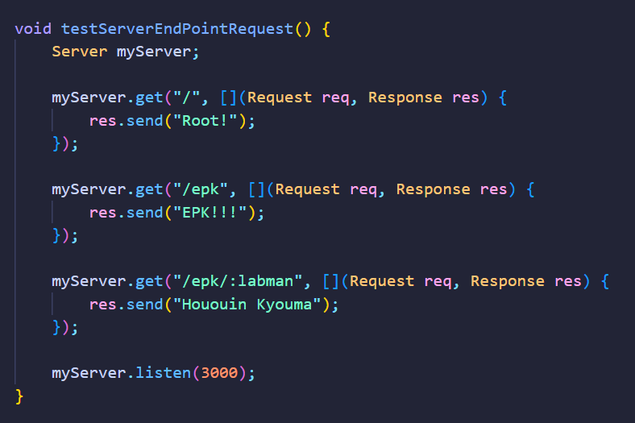

# C-Express
### Prologue note of the developer
With the desire to deep-dive into HTTP and Servers, bored(scared to enter in the kernel) in my own operating system project, i begin the development of the C-Express. 
Made in pure C++, in hope my abilities and knowledge of the language improve.
Keep in mind, that is not probably the best way to implement it, but well... I conceived that idea one year ago(09/2023), so why not implement it now that i have the properly capacities.
Hope you enjoy your journey throught that silly and strange code

### Concept
This project is a lightweight web-server library made in C++. 
Inspired by ExpressJS, the propose of the lib is to implement a generic and scalable web-server, that will be possible to create endpoints and its handlers.

### In-Scope
- Work to Windows and Linux
- Create endpoints(include endpoints with URL params)
- Response requests with plain/text and application/json
- Methods: GET, POST, PATCH, DELETE
- Work firstly with HTTP/1.1, and 1.0 in the final version(yup, i am a fail to HTTP philosophy)
- No cache will be implemented in the beta version

### Implementation
Made in pure C++
- Sockets(Windows and Linux)
- Threads

### Requirements
Requirements to use are simple, just have a Windows or Linux distro OS in your machine and put the lib on the correct path.
Requirements to build are just a C++ compiler
P.S: The project comes with a Makefile, so if you can run it, use "make build", and it will be ready in the build dir to move it to the right folder.

### How to use it
Put the lib compiled object in the right folder on your computer, and it will be ready to refer like any other lib.

## Documentation
### Getting started
Just like ExpressJS, you can define a route(endpoint) and listen to a port like:

### To do
- [ ] Sockets
  - [x] UnixSocket
  - [ ] WinSocket
- [ ] Server
  - [x] Routes definition
  - [x] Direct request to handler using req URL
  - [ ] Default handler to 404 request(no matching endpoint/route found)
- [ ] HTTPParser
  - [ ] HTTP/1.0
  - [ ] HTTP/1.1
  - [ ] Parse raw req and generate the Request object
  - [ ] Prepare the request, populating URL params in request attributes
- [ ] Request
  - [ ] Port in a good way the HTTP request data 
- [ ] Response
  - [ ] Generically generate HTTP Response text(scalable to re-use throught the methods implementation)
  - [ ] Select the status code to return
  - [ ] Response with plain text
  - [ ] Reponse with no body
  - [ ] Response with json
- [ ] Custom errors
